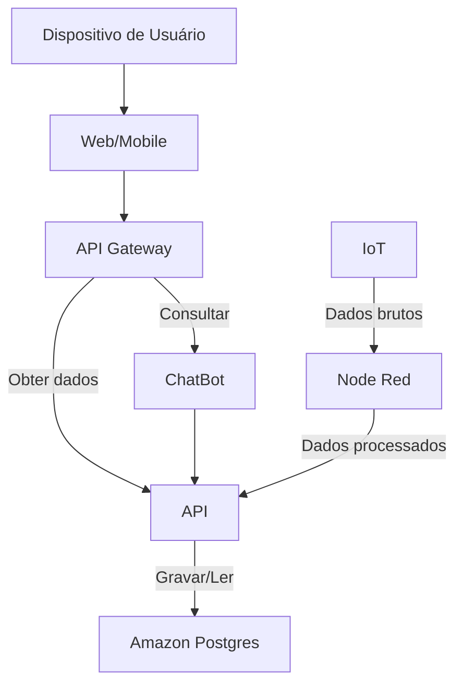

# Infraestrutura Cloud - Backend

## Arquitetura Geral

## Configuração
#### **Criação de Subnets**
&nbsp;&nbsp;&nbsp;&nbsp;&nbsp;&nbsp;&nbsp;&nbsp;Para garantir isolamento e segurança na arquitetura, utilizamos a VPC padrão como base e criamos sub-redes específicas para segregar os componentes do sistema. As sub-redes foram divididas em públicas e privadas, com o objetivo de controlar o acesso e proteger os recursos sensíveis. As sub-redes criadas incluem:

- **Subnets públicas**: Criadas apenas para implantar o NAT Gateway
- **Subnets privadas**: Criadas para implantar os serviços ECS e o ALB internal. Útil para isolá-los da **internet**.
- **VPC Link**: Um link que permite que a API Gateway trafegasse requisições a rede interna da VPC, no caso no modo de rede **awsvpc**

#### **Configuração do Banco de Dados RDS**
&nbsp;&nbsp;&nbsp;&nbsp;&nbsp;&nbsp;&nbsp;&nbsp;O banco de dados foi configurado utilizando o Amazon RDS PostgresSQL garantindo alta disponibilidade e escalabilidade. Ela está num sub-rede privada, livre de acesso externo, sendo possivel apenas ser acessado dentro da VPC.

&nbsp;&nbsp;&nbsp;&nbsp;&nbsp;&nbsp;&nbsp;&nbsp;A segurança do banco foi reforçada com a configuração de um **Security Group** específico, que permite apenas tráfego de entrada originado do serviço da API RESTful. Essa restrição limita o acesso ao banco, protegendo os dados contra exposições desnecessárias e garantindo que apenas a API tenha acesso a ele. 

#### **Configuração do ECS**
&nbsp;&nbsp;&nbsp;&nbsp;&nbsp;&nbsp;&nbsp;&nbsp;O serviço da API RESTful foi configurado utilizando o **AWS Fargate**, que permite a execução de contêineres sem a necessidade de gerenciar servidores. O processo de implantação seguiu as seguintes etapas:

1. **Task Definition**: Criamos uma **Task Definition** que define as especificações do contêiner da **API**, incluindo a imagem do contêiner, recursos computacionais (CPU e memória) e variáveis de ambiente. Essas variáveis de ambiente foram configuradas para fornecer as credenciais e informações necessárias para a conexão com o banco de dados (como endpoint, porta, nome do banco, usuário e senha). Também criamos outra **Task Definition** que define as especificações do contêiner do **Chatbot**. Passamos para ela a variavel de ambiente que contêm o endpoint da API que fornece dados.

2. **Cluster ECS**: Um cluster foi criado no **Amazon ECS** (Elastic Container Service) para gerenciar a execução do serviço da API e Chatbot. Ambos foram configurados para operar em sub-redes privadas, garantindo que a API e o Chatbot não sejam diretamente acessível pela internet, mas sim através da API Gateway.

3. **Configuração de Rede e Segurança**:
   - Cada serviço foi associado a um **Security Group** que permite tráfego de entrada apenas do **Security Group** vinculado ao **Application Load Balancer (ALB)**, e, no caso da API, permitir o tráfego vindo do **Security Group** do Chatbot.
   - Um **Target Group** foi configurado para cada serviço, permitindo que o ALB roteie o tráfego para as instâncias da API e Chatbot de forma eficiente, com verificações de saúde (health checks) para garantir a disponibilidade de ambos.

4. **Execução com Fargate**: O serviço foi implantado utilizando o motor do Fargate, que gerencia automaticamente a infraestrutura subjacente, permitindo escalabilidade e simplificando a operação.

#### Configuração do API Gateway

&nbsp;&nbsp;&nbsp;&nbsp;&nbsp;&nbsp;&nbsp;&nbsp;Implementamos o API Gateway para lidar com o tráfego vindo da Internet para os serviços internos. 

&nbsp;&nbsp;&nbsp;&nbsp;&nbsp;&nbsp;&nbsp;&nbsp;Definimos em *routes* quais rotas e métodos permitidos para acessar as instâncias. Usamos um **VPC Link** para conectar a API Gateway ao recurso ALB interno da VPC.

#### Beneficios
- Restringir tráfego
- Implementar Autenticação
- Segmentar por ambientes

[<- Retornar para README geral](../README.md)
