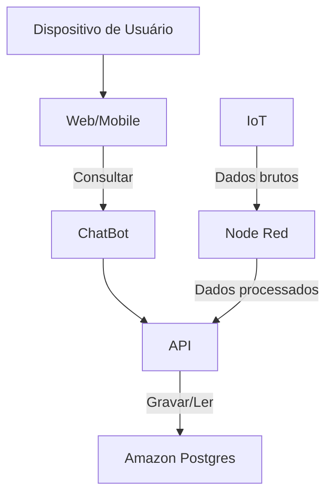

# Infraestrutura Cloud - Backend

## Arquitetura Geral

## Objetivo 

## Configuração
#### **Criação de Subnets**
Para garantir isolamento e segurança na arquitetura, utilizamos a VPC padrão como base e criamos sub-redes específicas para segregar os componentes do sistema. As sub-redes foram divididas em públicas e privadas, com o objetivo de controlar o acesso e proteger os recursos sensíveis. As sub-redes criadas incluem:

- **db-subnet**: Sub-rede privada dedicada ao banco de dados RDS Aurora, isolando-o de acessos externos diretos.
- **api-subnet**: Sub-rede privada destinada ao serviço da API RESTful, garantindo que a API seja acessível apenas por meio de rotas internas ou controladas.
- **Default**: Sub-rede padrão da VPC, utilizada para recursos que não requerem isolamento específico.
- **Outras sub-redes auxiliares**: Criadas para suportar funções adicionais, como redundância ou serviços complementares, conforme necessário.

#### **Configuração do Banco de Dados RDS**
O banco de dados foi configurado utilizando o Amazon RDS Aurora, com compatibilidade para PostgreSQL, garantindo alta disponibilidade e escalabilidade. O RDS Aurora foi implantado na sub-rede privada **db-subnet**, isolando-o de acessos externos. Para aumentar a resiliência, criamos um **grupo de sub-redes** que abrange múltiplas sub-redes privadas, permitindo que o RDS opere em diferentes zonas de disponibilidade (AZs) dentro da VPC.

A segurança do banco foi reforçada com a configuração de um **Security Group** específico, que permite apenas tráfego de entrada originado do serviço da API RESTful. Essa restrição limita o acesso ao banco, protegendo os dados contra exposições desnecessárias e garantindo que apenas a API possa interagir diretamente com o Aurora.

#### **Configuração do Serviço de API RESTful**
O serviço da API RESTful foi configurado utilizando o **AWS Fargate**, que permite a execução de contêineres sem a necessidade de gerenciar servidores. O processo de implantação seguiu as seguintes etapas:

1. **Task Definition**: Criamos uma **Task Definition** que define as especificações do contêiner da API, incluindo a imagem do contêiner, recursos computacionais (CPU e memória) e variáveis de ambiente. Essas variáveis de ambiente foram configuradas para fornecer as credenciais e informações necessárias para a conexão com o banco de dados Aurora (como endpoint, porta, nome do banco, usuário e senha).

2. **Cluster ECS**: Um cluster foi criado no **Amazon ECS** (Elastic Container Service) para gerenciar a execução do serviço da API. O serviço foi configurado para operar na sub-rede privada **api-subnet**, garantindo que a API não seja diretamente acessível pela internet.

3. **Configuração de Rede e Segurança**:
   - O serviço foi associado a um **Security Group** que permite tráfego de entrada apenas do **Security Group** vinculado ao **Application Load Balancer (ALB)**. Isso assegura que a API só receba requisições roteadas pelo ALB.
   - Um **Target Group** foi configurado para o serviço, permitindo que o ALB roteie o tráfego para as instâncias da API de forma eficiente, com verificações de saúde (health checks) para garantir a disponibilidade.

4. **Execução com Fargate**: O serviço foi implantado utilizando o motor do Fargate, que gerencia automaticamente a infraestrutura subjacente, permitindo escalabilidade e simplificando a operação.

---
