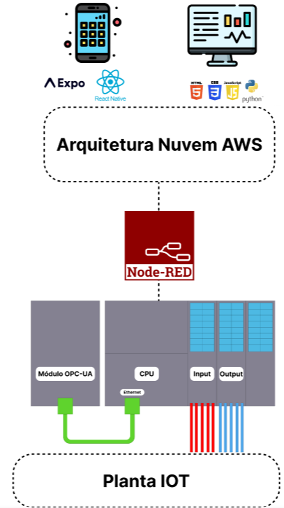

# ProjetoReciclagem

## Introdução

&nbsp;&nbsp;&nbsp;&nbsp;&nbsp;&nbsp;&nbsp;&nbsp;Projeto integrador que visa simular um sistema de reciclagem de materiais, com foco em uma aplicação que irá monitorar a planta e mostrará as informações de entrada e saída de materiais, além de calcular a quantidade de materiais reciclados e a quantidade de materiais descartados.

## Ferramentas
A aplicação contém:  

🧠 **CLP (Controlador Lógico Porgramável)**
- Usado linguagem SCL para a programação dele do recebimento de materiais, controle de estoque e saída de materiais. A comunicação de dados foi feita por OPC-UA, sendo ouvido pelo Node-Red.

🧹 **Limpeza de dados**
- O retorno das informações via OPC-UA vme de forma mais enxuta com informações que não serão totalmente aproveitadas, por esse motivo será usado o Node-Red para a limpeza dos dados e fazer a "ponte" com a comunicação com os serviços da AWS.

☁️ **AWS**
- Usado como banco de dados para armazenar as informações de entrada e saída de materiais, além servir como servidor web, mobile e do backend da aplicação, ficando fora dela somente o Node-Red e o CLP.

🗄️ **Modelagem do banco de dados**
- Essa aplicação precisava de um modelo de dados base para o desenvolvimento correto do backend da aplicação , por isso foi usado o SQL para a modelagem do banco de dados.

🛠️ **Backend**
- Foi usado Python com o framework FastAPI para um melhor desenvolvimento e integração com os relacionamentos entre as tabelas e inserção de dados.

🌐 **WEB**
- Uma interface de usuário para visualizar as informações da planta. Usando como linguagem somente HTML, CSS e JavaScript e uma landing page feita com Bootstrap.

📱 **MOBILE**
- Uma aplicação móvel com as mesmas ferramentas da interface web. Expo foi usado para criar a aplicação móvel.

