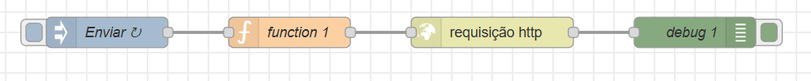

# Node-RED

## Introdução

&nbsp;&nbsp;&nbsp;&nbsp;&nbsp;&nbsp;&nbsp;&nbsp;Sistemas low-code, como o Node-RED, permitem que os desenvolvedores criem soluções de software sem escrever código. Eles fornecem interfaces visuais para construir fluxos de dados , tornando mais fácil a automação de processos e a integração de sistemas.

## Fluxo

## Blocos

### Inject / Enviar

&nbsp;&nbsp;&nbsp;&nbsp;&nbsp;&nbsp;&nbsp;&nbsp;Bloco que simula uma entrada/ start do fluxo.

### Function / Função

&nbsp;&nbsp;&nbsp;&nbsp;&nbsp;&nbsp;&nbsp;&nbsp;Bloco de códigos personalizados usando Java Script puro. 

### Request HTTP / Requisição HTTP

&nbsp;&nbsp;&nbsp;&nbsp;&nbsp;&nbsp;&nbsp;&nbsp;Bloco que permite a execução de requisições HTTP com metódos GET, POST, PUT, DELETE.

### Debug / Debug

&nbsp;&nbsp;&nbsp;&nbsp;&nbsp;&nbsp;&nbsp;&nbsp;Bloco que permite a visualização dos dados no console do Node-RED.

## Scritps

&nbsp;&nbsp;&nbsp;&nbsp;&nbsp;&nbsp;&nbsp;&nbsp;Temos um script nessa pasta:

* **Device-state.js:** Esse script permite a execução de uma função personalizada, onde foi feito mapeamento de uuid dos dispositivos e adicionados como parametro para a API.

[<- Retornar para README geral](../README.md)